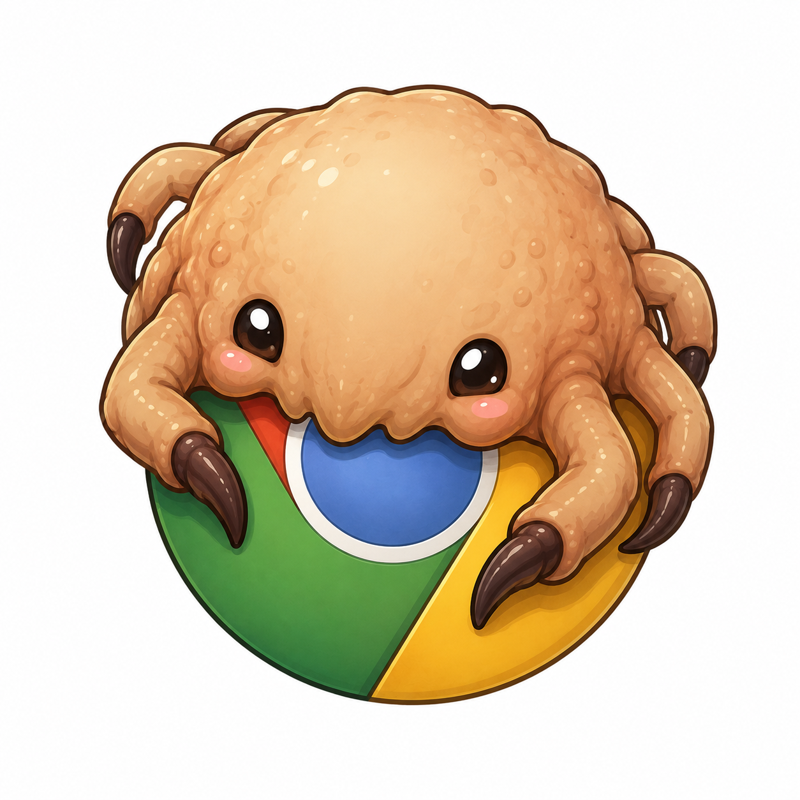

<p align="center">
  
</p>

# chrome-headcrab

Latch onto your **real Google Chrome** once (Chrome 144+ Allow dialog), hold a
persistent CDP driver daemon, and drive your live tabs forever without
re-prompting.

## Why

Chrome 144+ requires:

1. Enable remote debugging at `chrome://inspect/#remote-debugging`
2. Click **Allow** on each new CDP WebSocket attach

Opening a fresh CDP connection for every agent action is miserable. headcrab
attaches once, keeps the authorized WebSocket alive in a driver daemon, and
routes later `eval`/`tabs` calls over a Unix socket.

Need isolated Chromium clones / separate multi-agent browser contexts? → https://github.com/sourman/chad-browser

## Install

Requires: Google Chrome, Node 22+, Python 3.

```bash
git clone https://github.com/sourman/chrome-headcrab.git ~/work/chrome-headcrab
ln -sfn ~/work/chrome-headcrab ~/.claude/skills/chrome-headcrab
ln -sfn ~/work/chrome-headcrab/bin/chrome-headcrab ~/.local/bin/chrome-headcrab
```

## Core loop

```bash
# In Chrome first: chrome://inspect/#remote-debugging → enable

chrome-headcrab attach --name live     # click Allow once
chrome-headcrab tabs --name live
chrome-headcrab eval --name live --page 'document.title'
chrome-headcrab detach live            # driver only; Chrome stays up
```

HTTP discovery for tools that need `/json` (raw `:9222` 404s):

```bash
chrome-headcrab http --name live       # http://127.0.0.1:9224
```

## Docs

- [`SKILL.md`](SKILL.md) — agent entrypoint
- [`references/attach-and-allow.md`](references/attach-and-allow.md) — Chrome 144+ flow + gotchas + `--bg`
- [`references/driving.md`](references/driving.md) — full eval/helper surface
- [`references/workflows.md`](references/workflows.md) — attach/drive recipes
- [`references/commands.md`](references/commands.md) — CLI surface

## License

MIT
